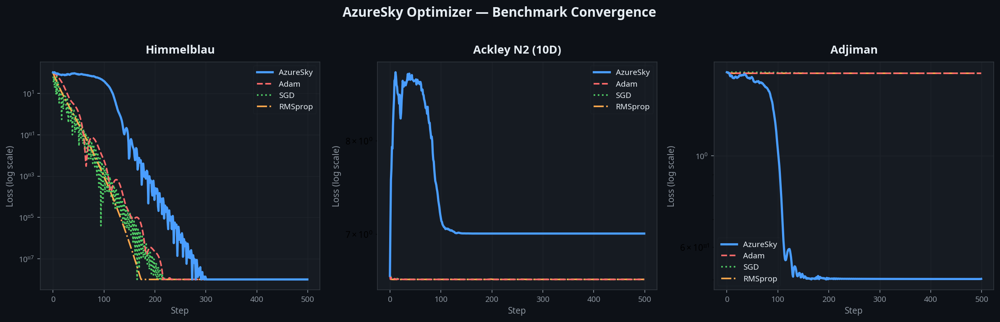
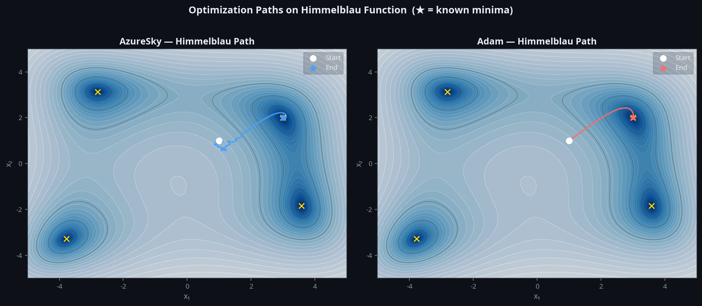
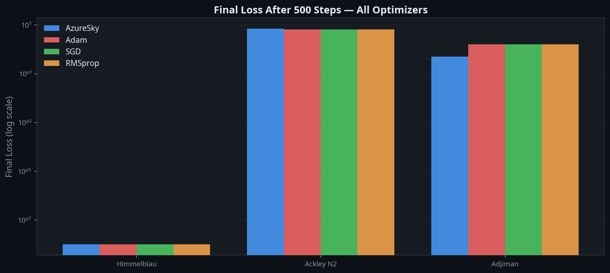

# Azure Sky Optimizer

Azure Sky Optimizer is a hybrid optimizer for PyTorch, integrating Simulated Annealing (SA) with Adam to provide robust exploration and precise exploitation in non-convex optimization tasks. Designed for complex machine learning challenges, Azure Sky excels in domains requiring deep exploration of rugged loss landscapes, such as scientific machine learning (SciML), symbolic reasoning, and protein folding.

Developed as part of an R&D initiative, Azure Sky combines structured stochastic exploration with gradient-based refinement. It acknowledges the fundamental trade-off in SciML: non-convex approaches offer more robust problem representation and noise resilience but introduce significant engineering complexity. Azure Sky balances this by achieving stable convergence and strong generalization in multi-modal search spaces.

---

## Overview

Conventional optimizers like Adam and AdamW often converge prematurely to sharp local minima, compromising generalization. Azure Sky leverages Simulated Annealing's global search in the early stages and Adam's local convergence later, ensuring both deep exploration and precise convergence.

### Core Innovations

- **Dynamic Temperature Scaling:** Adjusts SA temperature based on training progress for controlled exploration.
- **Exploration-Exploitation Fusion:** Seamlessly transitions between SA and Adam using a sigmoid-based blending mechanism.
- **Stability Enhancements:** Built-in gradient clipping and loss spike monitoring for robust training.

---

## Design Philosophy

Azure Sky is built for a specific class of problems that standard gradient-based optimizers handle poorly: **high-dimensional, non-convex landscapes** where the loss surface contains many competing local minima of similar depth. This is the defining characteristic of scientific machine learning (SciML) workloads — neural ODEs, physics-informed neural networks, symbolic regression, and energy-based models all share this property. In these settings, an optimizer that follows the local gradient faithfully will almost always converge to a suboptimal basin, and the quality of the solution found matters far more than the raw speed of convergence.

Azure Sky makes an explicit trade-off: **some per-step performance is sacrificed in exchange for convergence stability and solution quality**. The Simulated Annealing phase introduces controlled stochastic perturbations that allow the optimizer to escape sharp local minima and saddle points — structures that are endemic to high-dimensional non-convex problems. This is not a bug or a limitation; it is the intended behaviour. The SA noise is what gives the optimizer its ability to explore the loss landscape broadly before the Adam phase takes over for precise local refinement.

This places Azure Sky in the **hybrid metaheuristic-gradient** niche of the optimizer ecosystem, alongside methods like Stochastic Gradient Langevin Dynamics (SGLD) and Entropy-SGD. It is not a drop-in replacement for Adam in standard deep learning pipelines where the landscape is well-behaved — for those tasks, Adam or AdamW will converge faster. Azure Sky is the right tool when the problem demands robustness over speed: when you need confidence that the solution found is in a genuinely good basin, not just the nearest one.

---

## Performance

The Azure Sky optimizer has been rigorously tested against standard optimizers on complex mathematical benchmark functions. The plots below illustrate its performance across the Himmelblau, Ackley N2 (10D), and Adjiman functions over 500 optimization steps.



Azure Sky demonstrates rapid and stable convergence, particularly in high-dimensional and highly non-convex spaces. In the Himmelblau test, you can see the Simulated Annealing noise during the early steps (the blue path), which allows the optimizer to explore before settling into a global minimum.



*The Himmelblau path visualization shows Azure Sky (left) employing initial stochastic exploration before smoothly converging to a known minimum, compared to Adam's (right) direct gradient descent.*



---

## Key Features

- **Hybrid Optimization:** Combines SA’s global search with Adam’s local refinement.
- **Flexible Parameter Handling:** Supports parameter lists, named parameters, and parameter groups with group-specific learning rates.
- **Production-Ready Stability:** Includes PyTorch-native gradient clipping and loss spike detection hooks.
- **PyTorch Compatibility:** Fully integrated with PyTorch’s `optim.Optimizer` API.
- **Evaluation Dashboard:** Includes a Gradio-based frontend (`App.py`) for interactive benchmarking.

---

## Installation

Clone the repository and install dependencies using `pip` or your preferred package manager.

```bash
git clone https://github.com/DarkStarStrix/Azure_Sky.git
cd Azure_Sky
pip install -e .
```

**Requirements:**
- Python >= 3.10
- PyTorch >= 2.0.0
- NumPy >= 1.24.0, < 2.0.0
- SciPy >= 1.11.0
- Matplotlib >= 3.7.0
- Gradio >= 4.0.0

---

## Usage Examples

Azure Sky integrates seamlessly into PyTorch workflows. It acts as a drop-in replacement for standard optimizers like `torch.optim.Adam`.

### Basic Usage

```python
import torch
import torch.nn as nn
from Backend.optimizers.azure_optim import Azure

# Define a simple model and loss function
model = nn.Linear(10, 2)
criterion = nn.CrossEntropyLoss()

# Initialize the Azure optimizer
optimizer = Azure(model.parameters(), lr=0.001, sa_steps=100)

# Dummy data
inputs = torch.randn(32, 10)
targets = torch.randint(0, 2, (32,))

# Standard PyTorch training step
optimizer.zero_grad()
outputs = model(inputs)
loss = criterion(outputs, targets)
loss.backward()
optimizer.step()
```

### Parameter Groups with Custom Learning Rates

You can define parameter groups to apply different learning rates or configurations to specific layers of your model.

```python
class SimpleModel(nn.Module):
    def __init__(self):
        super().__init__()
        self.base = nn.Linear(10, 5)
        self.classifier = nn.Linear(5, 2)

    def forward(self, x):
        x = torch.relu(self.base(x))
        return self.classifier(x)

model = SimpleModel()

# Apply a higher learning rate to the base layer
optimizer = Azure([
    {'params': model.base.parameters(), 'lr': 1e-2},
    {'params': model.classifier.parameters(), 'lr': 1e-3}
])
```

For a complete runnable script, see `usage_example.py` in the repository root.

---

## Hyperparameters

Azure Sky introduces several unique hyperparameters to control the Simulated Annealing phase:

| Parameter   | Default | Description |
|-------------|---------|-------------|
| `lr`        | 1e-3    | Base learning rate for the Adam phase. |
| `T0`        | 1.0     | Initial temperature for Simulated Annealing. |
| `sigma`     | 0.1     | Perturbation strength (noise scaling factor) for SA. |
| `sa_steps`  | 1000    | Number of steps during which the SA phase is active before fully transitioning to Adam. |
| `sa_momentum`| 0.9    | Momentum factor for SA updates. |

---

## Project Status

As of **May 14, 2026**, the Azure Sky Optimizer codebase has undergone a comprehensive rewrite. It is fully PyTorch-native, stable, and structurally sound.

**Recent Improvements:**
- Complete unification of the benchmark suite to use PyTorch tensors (eliminating SciPy/NumPy mismatches).
- Refactored core optimizers with proper PyTorch state management and closure support.
- Added a functional smoke test suite (`test_smoke.py`).

**Planned improvements:**
- Integration with PyTorch Lightning.
- Extended ablation studies for hyperparameter impact on large-scale datasets (CIFAR-10, ImageNet).

For questions or collaboration, please open an issue on GitHub.

---

## Citation

If you use Azure Sky Optimizer in your research or engineering projects, please cite:

```text
[Allan]. (2026). Azure Sky Optimizer: A Hybrid Approach for Exploration and Exploitation. GitHub Repository.
```

## License

This project is licensed under the MIT License. See the [LICENSE](LICENSE) file for details.
